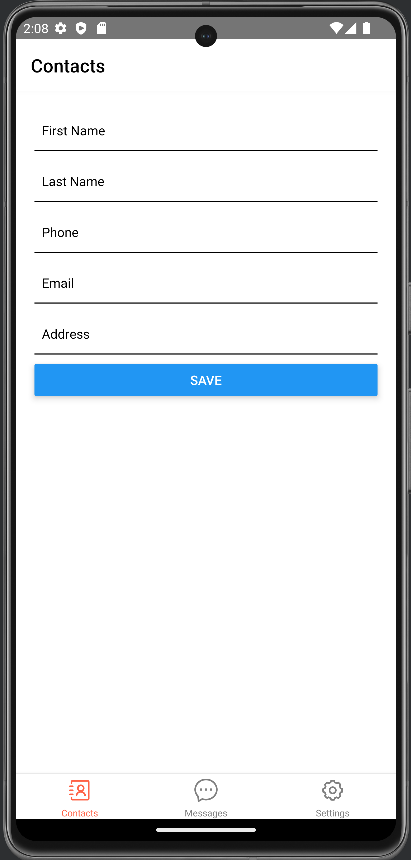
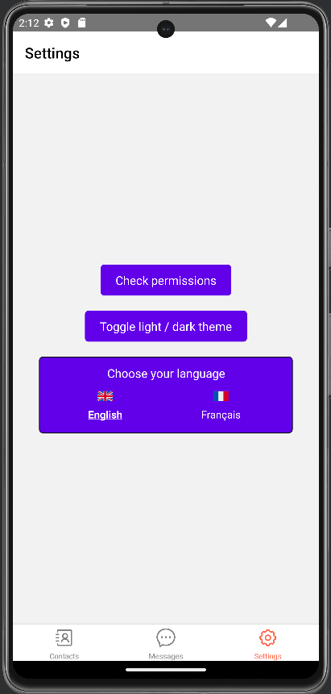

# FT_Hangouts - React Native

Welcome to the FT_Hangouts repository, developed using React Native! This application is compatible with Android platforms. This is my second React Native project.


Follow the instructions below to set up and test the application.

**Developed and tested on a Linux Ubuntu 23.04 and Android 12 / 13**

----

## Prerequisites

### Development Environment

**Node.js & npm**: Required to manage the project's dependencies and run the development server -> [Download Node.js](https://nodejs.org/).

**React Native CLI**: Used to initiate new React Native projects and execute commands.

``npm install -g react-native-cli``

**Android Studio & Android SDK**: Required for emulating and debugging React Native applications for Android -> [Download Android Studio](https://developer.android.com/studio).

----
## Installation

1. **Clone the repository:**

````
git clone https://github.com/jmbertin/FT_Hangouts.git
cd FT_Hangouts
````


3. **Install the dependencies:**

````
chmod +x manage.sh
./manage.sh install
````

4. **Running**

Start an Android emulator through Android Studio or connect an Android device with USB debugging mode enabled then :

````
./manage.sh start
````

And press **a** button in the Metro menu.

5. **Stop**

Just press **CTRL+C**.


6. **Build bundle & APK**

````
./manage.sh build
````
Two versions will be managed, one in a format compatible with distribution on the Google Store (.aab), the second, installable directly on Android phone (.apk).

````
android/app/build/outputs/apk/release/app-release.apk
android/app/build/outputs/bundle/release/app-release.aab
````

7. **Cleaning**

````
./manage.sh clean
````

----

## Screenshots







----

## Contributing
If you wish to contribute to the project, please create a pull request and detail the changes you're proposing.
